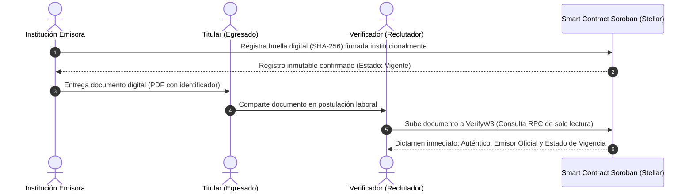

# VerifyW3 🎓🔒

> **Plataforma descentralizada para la verificación instantánea, matemática e inmutable de autenticidad y vigencia de títulos y certificaciones con tecnología Stellar Blockchain y Soroban Smart Contracts.**

[](https://stellar.org/)
[-orange?style=flat)](https://soroban.stellar.org/)
[](https://github.com/users/roguar2010/projects/1)
[-teal?style=flat)](#)

---

## 📌 Visión general del proyecto

Hoy en día, comprobar que un diploma, curso o certificación es auténtico y sigue vigente es un proceso **lento, costoso y vulnerable al fraude**:
- **Lentitud operativa:** Las entidades educativas tardan entre **5 y 10 días hábiles** en responder solicitudes manuales por correo.
- **Riesgo de fraude:** Alto volumen de falsificaciones y alteraciones digitales en calificaciones o fechas.
- **Falta de estándar:** Inexistencia de un canal unificado para consultar credenciales expedidas por múltiples instituciones (universidades, academias, bootcamps).

**VerifyW3** resuelve este problema permitiendo a empresas, evaluadores de selección y reclutadores comprobar la integridad, emisor legítimo y estado de vigencia de cualquier certificación educativa en **menos de 60 segundos**, sin intermediarios ni demoras burocráticas.

---

## 🚀 Propuesta de valor y ventajas clave

* ⏱️ **Verificación en segundos:** Validación autónoma e instantánea mediante el navegador arrastrando el archivo digital o ingresando su código.
* 🛡️ **Detección de fraude al 100%:** Cualquier alteración en nombres, calificaciones o fechas genera una huella criptográfica distinta que es detectada de inmediato.
* 🔐 **Privacidad por diseño (*Off-chain*):** Cumplimiento estricto de la **Ley 1581 de 2012 (Habeas Data)**. Los datos personales sensibles del titular **nunca** se almacenan en la red blockchain; únicamente se registra la huella matemática (hash SHA-256) calculada localmente en el dispositivo.
* ⚡ **Eficiencia y escalabilidad Stellar:** Tiempos de confirmación de bloque de **3 a 5 segundos** y costos por transacción inferiores a **$0.00001 USD**, haciendo sostenible la adopción institucional.
* 📜 **Histórico inalterable:** Ni el emisor ni el operador de la plataforma pueden borrar o manipular retroactivamente un registro expedido; las anulaciones o revocaciones quedan asentadas como nuevos eventos auditables en tiempo real.

---

## ⚙️ ¿Cómo funciona?



---

## 🏛️ Arquitectura técnica inicial

| Capa | Componente | Responsabilidad |
| :---: | :--- | :--- |
| **Interfaz (Frontend)** | Next.js / React + Tailwind CSS | Portal público de consulta rápida para evaluadores y panel institucional de gestión para emisores con conexión de billetera. |
| **Lógica Cliente** | Módulo de Hash Local + Stellar SDK | Cálculo de huellas criptográficas SHA-256 en el navegador del usuario (sin exponer datos personales en servidores) e interacción RPC con la red. |
| **Red Blockchain** | Soroban Smart Contracts (Rust) + Stellar Ledger | Mapeo inmutable de huellas digitales, identificadores únicos, direcciones de instituciones acreditadas y estados de vigencia (Vigente / Revocado). |

---

## 📂 Estructura del repositorio

```text
VerifyW3/
├── docs/
│   ├── semana1/                  # Fase 1: Identificación del problema
│   │   ├── ProblemBrief.md       # Documento grupal con análisis de pertinencia y evidencia
│   │   ├── EstefanyGuerra.md     # Propuesta individual
│   │   ├── NicolasGonzalez.md    # Propuesta individual (Base de VerifyW3)
│   │   └── RonaldGuarin.md       # Propuesta individual
│   └── semana2/                  # Fase 2: Diseño de producto y alcance MVP
│       ├── ProductBlueprint.md   # Blueprint completo (historias, propuesta, flujo, arquitectura)
│       ├── LeanCanvas.png        # Modelo de negocio gráfico oficial de 9 bloques
│       ├── EstefanyGuerra.md     # Historias de usuario individuales priorizadas
│       ├── NicolasGonzalez.md    # Historias de usuario individuales priorizadas
│       └── RonaldGuarin.md       # Historias de usuario individuales priorizadas
└── README.md                     # Resumen general del proyecto
```

---

## 🔗 Enlaces importantes del proyecto

* **Repositorio oficial:** [https://github.com/roguar2010/VerifyW3](https://github.com/roguar2010/VerifyW3)
* **Tablero Kanban de Backlog:** [GitHub Projects - VerifyW3 Backlog](https://github.com/users/roguar2010/projects/1)
* **Product Blueprint:** [`docs/semana2/ProductBlueprint.md`](docs/semana2/ProductBlueprint.md)
* **Lean Canvas:** [`docs/semana2/LeanCanvas.png`](docs/semana2/LeanCanvas.png)

---

## 👥 Equipo de trabajo

| Integrante | Usuario de GitHub | Rol en el proyecto |
| :--- | :---: | :--- |
| **Nicolás González Franco** | [@FRANGONICOLAS](https://github.com/FRANGONICOLAS) | Desarrollador / Responsable de entregas |
| **Estefany Carolina Guerra G** | [@Eguerrag](https://github.com/Eguerrag) | Project Manager |
| **Ronald Guarín** | [@roguar2010](https://github.com/roguar2010) | Líder Técnico |

---

*Desarrollado en el marco del programa Blockchain Builders 101 Colombia (BAF LATAM).*
