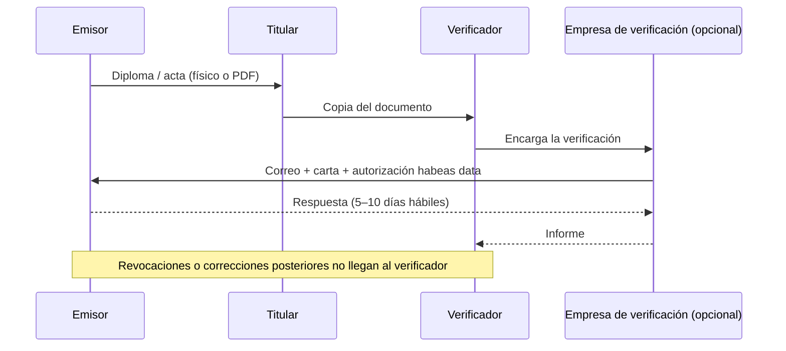

# Problem Brief

## Decisión del problema

### Problema elegido

Las personas que acumulan títulos, cursos y certificaciones de distintas instituciones no tienen una forma rápida y confiable de demostrar ante terceros que esas credenciales son auténticas y siguen vigentes, y quienes las reciben no pueden comprobarlo sin contactar uno por uno a cada emisor.

**Propuesto por:** Nicolás González Franco ([@FRANGONICOLAS](https://github.com/FRANGONICOLAS)).

### Por qué elegimos este

| Criterio | Credenciales verificables (Nicolás) | Transparencia de donaciones (Estefany) | Pagos P2P con garantía (Ronald) |
|---|---|---|---|
| **1.** Varias partes que no confían entre sí necesitan un mismo registro | ✅ Emisores, titulares y verificadores independientes entre sí | ⚠️ Hay donantes y organización, pero el registro lo alimenta solo la organización | ✅ Comprador y vendedor desconocidos |
| **2.** El histórico no puede alterarse, ni siquiera por quien lo administra | ✅ Ni el propio emisor puede reescribir una credencial ya emitida | ⚠️ Las donaciones sí quedan fijas, pero los gastos ocurren fuera de la cadena y dependen de lo que declare la organización | ✅ Las condiciones del pago quedan fijas en el contrato |
| **3.** Hay un intermediario que existe solo para conectar la confianza | ✅ Verificación manual por correo y empresas de verificación de antecedentes | ❌ La organización no es un intermediario: es quien ejecuta la causa | ⚠️ La pasarela desaparece, pero las disputas exigen un árbitro |
| **Viabilidad del MVP** | Alta: emitir, verificar y revocar sin mover dinero | Media: fácil registrar aportes, difícil probar los gastos | Media-baja: exige dinero real, criptoactivos y resolución de disputas |

### Propuestas descartadas

**1. Transparencia en el uso de donaciones a causas sociales**
*Propuesta por:* Estefany Carolina Guerra G ([@Eguerrag](https://github.com/Eguerrag))

- **Público objetivo:** los donantes pequeños de campañas en redes pagan por transferencia o billetera digital. Pedirles usar criptoactivos reduce la adopción.

**2. Pagos seguros entre desconocidos en compraventas P2P (depósito en garantía)**
*Propuesta por:* Ronald Guarín ([@roguar2010](https://github.com/roguar2010))

- **Limitante principal:** un contrato inteligente no puede saber si el producto físico llegó o si está en buen estado. Cuando comprador y vendedor no coinciden, alguien tiene que arbitrar la disputa, y ese árbitro vuelve a ser un intermediario de confianza.

- **Público objetivo:** compradores y vendedores informales que hoy pagan en efectivo o por transferencia. Exigirles comprar criptoactivos o stablecoins antes de cada compra es una barrera alta.
- **Viabilidad del MVP:** manejar dinero real implica riesgos de custodia de fondos, regulación financiera y pérdidas para el usuario.

### Cómo tomamos la decisión

Llegamos a un **consenso tras debate**:

1. Cada integrante presentó su propuesta individual al equipo.
2. Leímos todas las propuestas y, para cada una, analizamos tres aspectos:
   - sus **limitantes**, es decir, qué parte del problema no puede resolver un registro distribuido;
   - su **público objetivo**: a quién le sirve y qué tan dispuesto estaría a adoptarla;
   - su **viabilidad como MVP** dentro de los tiempos del bootcamp.
3. Contrastamos cada propuesta con los tres criterios.
4. La propuesta de credenciales verificables fue la que mejor resistió el análisis, y el equipo acordó adoptarla.

---

## Problem Brief

### Encabezado

**Verificación de certificados y titulos haciendo uso de tecnologias Blockchain - VerifyW3** 

Verificar hoy un título o certificado exige días de correos y trámites con cada institución emisora; queremos que cualquier tercero pueda comprobar su autenticidad y vigencia en segundos.

### Equipo y roles

| Integrante | Usuario de GitHub | Rol |
|---|---|---|
| Nicolás González Franco | [@FRANGONICOLAS](https://github.com/FRANGONICOLAS) | `Desarrollador` |
| Estefany Carolina Guerra G | [@Eguerrag](https://github.com/Eguerrag) | `Project manager` |
| Ronald Guarín | [@roguar2010](https://github.com/roguar2010) | `Lider tecnico` |
| NN | @Celsocpp | `Desarrollador` |

- **Responsable de las entregas:** `Nicolas Gonzalez Franco`
- **Canal de coordinación interna:** WhatsApp

### Problema y evidencia

**Enunciado:** las personas no pueden demostrar de forma rápida y confiable que sus títulos, cursos o certificaciones son auténticos y vigentes, y quienes los reciben no pueden comprobarlo sin contactar a cada institución emisora.

**Contexto, frecuencia y alcance.** El problema aparece cada vez que alguien presenta credenciales para un empleo, una admisión a posgrado, una vinculación al sector público o el trámite de una tarjeta profesional. Afecta más a quien tiene credenciales de varias instituciones (pregrado, diplomados, bootcamps, certificaciones técnicas), porque cada emisor usa un formato y un canal de verificación distinto. La educación no formal (cursos y certificaciones) casi no cuenta con un registro de consulta común.

**Evidencia:**

- **La falsificación es frecuente.** En 2023, la Fiscalía abrió 8.901 procesos por delitos de falsedad en documento, la familia de delitos que incluye la falsificación de títulos ([El Colombiano, 2023](https://www.elcolombiano.com/colombia/asi-sera-el-plan-para-tumbar-redes-que-falsifican-titulos-academicos-CH22343562)).
- **Hay casos en el sector público.** En diciembre de 2024, la Procuraduría formuló cargos a ocho docentes y funcionarios de la Secretaría de Educación de Bogotá por presuntos diplomas falsos de universidades reconocidas ([Procuraduría](https://www.procuraduria.gov.co/Pages/presunta-falsificacion-titulos-universitarios-ocho-maestros-bogota-juicio-disciplinario.aspx)). La prensa reportó 16 procesos en curso y títulos comprados desde $100.000 ([Infobae](https://www.infobae.com/colombia/2024/11/30/los-estudiantes-podrian-estar-aprendiendo-de-maestros-falsos-en-bogota-esto-se-sabe-del-presunto-cartel-de-los-docentes/)).
- **La verificación es manual y lenta.** El Politécnico JIC responde en 5 días hábiles a solicitudes enviadas por correo con carta membretada ([fuente](https://www.politecnicojic.edu.co/verificaciones-de-titulo)). La Fundación Universitaria San Martín tarda 10 días hábiles y exige una autorización de habeas data firmada ([fuente](https://sanmartin.edu.co/verificacion-titulos/)).
- **El mercado ya se mueve.** En junio de 2026, un politécnico de Medellín adoptó credenciales verificables con código QR para que los empleadores comprueben su autenticidad sin llamar a la institución ([Informativo Colombia](https://informativocolombia.com/actualidad/titulos-falsos-en-colombia-la-verificacion-con-blockchain-y-codigo-qr-llega-a-los-certificados)).

### Usuario y actores

**Usuario principal: el titular de la credencial** (egresado, estudiante o profesional en formación continua). Necesita presentar sus credenciales una sola vez y que el tercero las acepte sin fricción. Hoy guarda PDF y escaneos dispersos, solicita certificados o duplicados al emisor (a veces pagando), los envía por correo, firma autorizaciones de tratamiento de datos y espera. Esto le cuesta días o semanas en cada proceso, pagos por certificados y, en el peor caso, oportunidades perdidas cuando la verificación no llega a tiempo. Si su título es extranjero, suma apostilla, traducción y convalidación.

**Usuario secundario: el verificador** (talento humano de una empresa, oficina de admisiones o entidad pública). Necesita saber que la credencial es auténtica, que no fue alterada y que no ha sido revocada. Hoy revisa el documento a ojo, escribe a cada emisor y espera entre 5 y 10 días hábiles, o paga a una empresa de verificación de antecedentes. Le cuesta horas-persona por cada candidato y credencial, y asume el riesgo de vincular a alguien con un título falso.

**Otros actores:**

| Actor | Papel en el flujo |
|---|---|
| Institución emisora (universidad, institución de educación para el trabajo, academia, plataforma de cursos, certificador técnico) | Expide la credencial y atiende manualmente cada solicitud de verificación |
| Ministerio de Educación / SNIES | Registra instituciones y programas de educación superior; convalida títulos extranjeros |
| Consejos profesionales (p. ej. COPNIA) | Exigen el título para expedir la tarjeta profesional en profesiones reguladas |
| Cancillería | Apostilla documentos para su uso en el exterior |
| Empresas de verificación de antecedentes | Intermediarios pagados que hacen la verificación por el empleador |
| Fiscalía y Procuraduría | Investigan y sancionan cuando se detecta una falsificación |

### Flujo actual de valor

El activo que se mueve es **información**: la afirmación de que "la institución X certifica que la persona Y obtuvo Z en la fecha F".

1. **Formación.** La persona aprueba el programa en la institución emisora.
2. **Registro interno.** El emisor registra el grado en su sistema académico y en el libro de actas.
3. **Expedición.** El emisor entrega el diploma y el acta de grado, en físico o en PDF, a veces con un código o QR que apunta a su propio portal.
4. **Trámites del titular**: Tarjeta profesional ante el consejo respectivo en profesiones reguladas, convalidación ante el Ministerio de Educación para títulos extranjeros, apostilla ante la Cancillería para uso en el exterior.
5. **Envío.** El titular envía copias (PDF o escaneo) al verificador.
6. **Solicitud de verificación.** El verificador, directamente o a través de una empresa de verificación de antecedentes, escribe al emisor con carta membretada, copia del documento y autorización del titular.
7. **Respuesta.** El emisor consulta su archivo y responde por correo en tiempo de días hábiles. Si detecta una falsificación, denuncia.
8. **Decisión.** El verificador acepta o rechaza al candidato.
9. **Después.** Si la credencial se corrige o se revoca, nadie avisa al verificador.

### Fricciones identificadas

| # | Fricción | Paso | Causa | A quién afecta |
|---|---|---|---|---|
| F1 | El documento recibido no prueba nada por sí mismo | 5 | Un PDF o escaneo se edita fácilmente y no lleva una prueba de integridad que un tercero pueda comprobar de forma independiente | Verificador (riesgo de fraude) y titulares honestos (se desconfía de todos) |
| F2 | La verificación tarda días | 6–7 | El proceso es manual, por correo y depende de la disponibilidad del emisor | Titular (retrasa su vinculación), verificador (frena la contratación) y emisor (carga operativa) |
| F3 | Cada emisor tiene su propio canal | 6 | No existe un estándar común: formularios, correos, teléfonos o portales distintos, y casi nada para cursos y certificaciones | Verificador, que multiplica el esfuerzo por cada credencial del candidato |
| F4 | Las revocaciones y correcciones no se propagan | 9 | La verificación es una fotografía de un momento; no hay un estado consultable en el tiempo | Verificador (puede confiar en una credencial anulada) |
| F5 | Los datos personales circulan por correo | 6 | Para verificar hay que enviar cédula, documentos y autorizaciones a varios actores | Titular (exposición de datos) y emisor/verificador (responsabilidad legal) |
| F6 | La verificación depende de que el emisor siga existiendo | 7 | Si la institución cierra, pierde archivos o su portal cae, no hay quién confirme | Titular, que no puede probar su formación |

### Oportunidad e hipótesis

**Oportunidad priorizada: la verificación de autenticidad y estado en el momento en que el tercero recibe la credencial (F1, F2 y F4).**

La elegimos porque concentra el mayor costo del flujo (días de espera y riesgo de fraude), afecta a los tres actores y cabe en un MVP. F3 y F6 mejoran como consecuencia si varios emisores usan el mismo registro. F5 se aborda en el diseño, al no llevar datos personales a la cadena.

**Hipótesis.** Si cada emisor, al expedir una credencial, registra en una red blockchain una **huella criptográfica (hash) del documento**, su **identificador**, la **identidad del emisor** y su **estado** (vigente, revocada o reemplazada), entonces:

- **El verificador** podría comprobar en segundos, sin escribirle a nadie, que el documento que recibió es idéntico al emitido, quién lo emitió y si sigue vigente. Hoy eso le toma días.
- **El titular** podría compartir un enlace o un QR una sola vez, sin enviar su cédula ni firmar autorizaciones a cada verificador, y conservaría una prueba de su formación aunque la institución deje de existir.
- **El emisor** dejaría de atender verificaciones manuales. Solo actuaría al emitir, corregir o revocar, y esos cambios serían visibles de inmediato para cualquier tercero.

**Métrica para validarla en el MVP:** el tiempo que toma verificar una credencial (de días a menos de un minuto) y la detección del 100 % de los documentos alterados o revocados en las pruebas.

### Criterio de pertinencia

**1. Varias partes que no confían entre sí comparten un mismo registro.** Los emisores son muchos, independientes y a veces competidores: universidades, academias, plataformas de cursos y certificadores. Una base de datos centralizada exigiría que todos acepten a un operador único con poder para escribir, modificar o borrar registros ajenos. Para la educación superior formal ese papel lo cumple en parte el Estado, pero para cursos, bootcamps y certificaciones no existe nadie así. En un registro distribuido, cada emisor escribe solo con su propia llave y nadie, ni siquiera el operador de la plataforma, puede alterar lo que otro emitió.

**2. El histórico no puede alterarse, ni siquiera por quien lo administra.** El valor de una credencial depende de que lo registrado en la fecha de emisión no cambie después. Los casos de títulos falsos muestran que el riesgo también está dentro de las instituciones. En una base de datos tradicional, su administrador puede insertar, cambiar o borrar registros sin dejar rastro. En blockchain, ni el emisor ni quien opere la plataforma pueden reescribir una credencial emitida: cada corrección o revocación queda como un evento nuevo, con fecha y firma, sin borrar el anterior.

**3. Hay un intermediario que existe solo para conectar la confianza.** Hoy la confianza pasa por la verificación manual por correo en la oficina del emisor y por las empresas de verificación de antecedentes, que cobran por confirmar lo que el emisor ya sabe. Con un registro público, cualquier tercero comprueba la credencial por sí mismo, sin permiso ni intermediación, incluso si el emisor está caído o ya no existe.

**Por qué no basta con integrar los sistemas existentes:** conectar N emisores con M verificadores implica N × M integraciones y acuerdos bilaterales, y sigue dependiendo de que cada sistema esté disponible. Un registro común reduce el problema a un único punto de consulta.

### Supuestos y riesgos

**Supuesto 1: los emisores están dispuestos a registrar sus credenciales.** Sin emisores no hay nada que verificar. Asumimos que el ahorro en verificaciones manuales y la mejora en la empleabilidad de sus egresados compensan el esfuerzo de adopción.
*Lo invalidaría:* que en conversaciones con 3 a 5 instituciones el costo de integración con sus sistemas académicos o el costo de transacción en la red resulten inaceptables, o que prefieran seguir cobrando por certificados.

**Supuesto 2: el verificador puede confiar en que una identidad en la cadena corresponde realmente al emisor que dice ser.** Blockchain garantiza que un registro no fue alterado, no que quien lo escribió sea legítimo.
*Lo invalidaría:* no poder resolver cómo se vincula la dirección o llave de una institución con su identidad real (por ejemplo, mediante un registro de emisores autorizados o su dominio web). Si esto falla, el problema del "diploma falso" se convierte en el problema del "emisor falso".

**Supuesto 3: el sistema cumple la ley de protección de datos (Ley 1581 de 2012) sin guardar datos personales en la cadena.** Solo se registrarían hashes, identificadores y estados; el documento con los datos queda en manos del titular.
*Lo invalidaría:* que un hash de datos poco variables (nombre + cédula + programa) pueda reconstruirse por fuerza bruta, lo que exige agregar un valor aleatorio (*salt*), o que el derecho de supresión choque con la inmutabilidad del registro.

**Riesgo transversal:** la cadena garantiza integridad, no veracidad. Si una institución emite una credencial a quien no cursó el programa, el sistema la registrará como válida. El valor está en la trazabilidad, no en eliminar el fraude del propio emisor.
