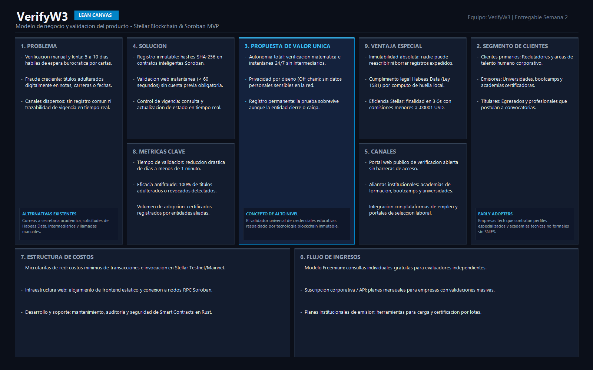
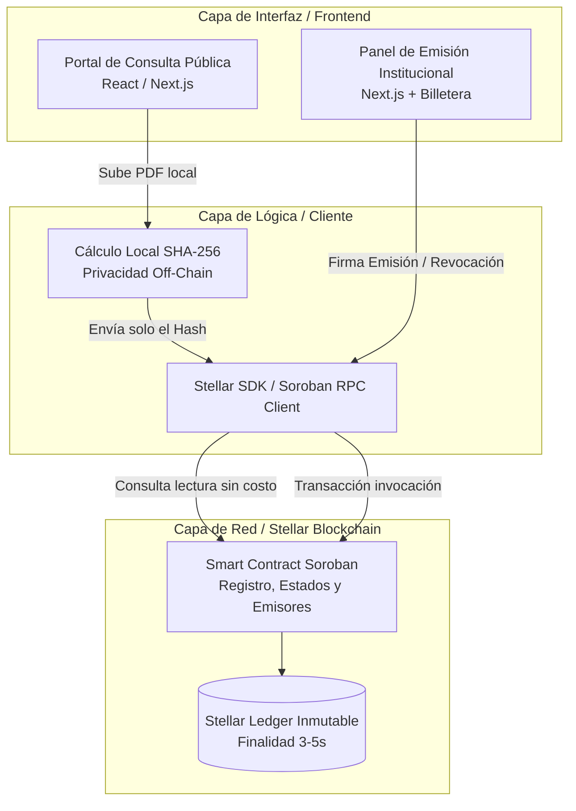

# Product Blueprint

**Nombre del proyecto:** VerifyW3

**Repositorio:** [VerifyW3](https://github.com/roguar2010/VerifyW3)

---

## Contenido

1. Priorización de historias
2. Propuesta de valor
3. Flujo de usuario
4. Alcance del MVP
5. Lean Canvas
6. Backlog priorizado (Kanban)
7. Arquitectura inicial
8. Uso de Stellar y justificación

---

## 1. Priorización de historias

**Criterio de priorización:** Clasificación en cuatro niveles de impacto (*Imprescindible, Debería, Podría, Queda afuera*), garantizando que cada historia responda a una necesidad clara del usuario sin tecnicismos en su redacción.

| Prioridad | Historia | Propuesta por | Por qué entra al backlog |
| :---: | --- | :---: | --- |
| **1 (Imprescindible)** | Como analista de selección, quiero comprobar si el certificado de un candidato es auténtico y sigue vigente, para decidir su vinculación de inmediato sin trámites manuales. | Nicolás González / Estefany Guerra | Es el núcleo del producto y resuelve la hipótesis central: validar autenticidad y vigencia en segundos. Sin esto no hay producto. |
| **2 (Imprescindible)** | Como analista de selección, quiero subir el archivo digital presentado por un aspirante, para detectar de inmediato si sufrió alguna alteración respecto al original. | Ronald Guarín | Es el mecanismo directo de detección de fraude documental. Garantiza la integridad del archivo que el reclutador tiene en sus manos. |
| **3 (Imprescindible)** | Como institución educativa, quiero registrar cada certificado que expido con un identificador único, para que terceros comprueben su validez sin tener que escribirme. | Nicolás González / Estefany Guerra | Condición previa de todo el sistema. Si la institución no genera el registro de origen, no existe base para que nadie verifique. |
| **4 (Imprescindible)** | Como institución educativa, quiero anular un certificado expedido por error o sanción, para que las empresas conozcan su pérdida de validez en tiempo real. | Nicolás González / Estefany Guerra | Cierra el ciclo mínimo de valor (emitir → verificar → anular → re-verificar) y asegura que las revocaciones se propaguen al instante. |
| **5 (Debería)** | Como analista de selección, quiero confirmar que la entidad emisora es una institución legítima, para no aceptar credenciales de organizaciones ficticias. | Estefany Guerra / Nicolás González | Mitiga el riesgo de "emisor falso". Es prioritario, pero en la fase inicial del MVP puede respaldarse con una lista curada de emisores. |
| **6 (Podría)** | Como reclutador en entrevistas presenciales, quiero escanear un código visual en el documento físico, para validar el título al instante desde mi teléfono. | Ronald Guarín | Facilita la experiencia en ferias de empleo y diplomas físicos, aunque no bloquea la validación digital por carga de archivo. |
| **7 (Queda afuera)** | Como coordinador académico, quiero cargar por lotes la lista completa de graduados de una cohorte, para emitir todos sus certificados en un solo paso. | Ronald Guarín | Aporta eficiencia operativa masiva, pero no altera el principio de funcionamiento del MVP inicial. Se reserva para fases posteriores. |
| **8 (Queda afuera)** | Como egresado con certificaciones de varias entidades, quiero reunir todos mis títulos en un panel único, para compartirlos en conjunto al postularme. | Estefany Guerra / Nicolás González | Es una funcionalidad deseable de conveniencia para el titular, pero solo cobra verdadero sentido cuando existan múltiples instituciones conectadas. |

---

## 2. Propuesta de valor

**Usuario (del Problem Brief):** Analista de selección y talento humano (usuario que toma la decisión de contratación) y, de forma concurrente, el titular de la credencial (egresado que necesita acreditar su formación con inmediatez y sin fricciones burocráticas).

**Resultado que obtiene:** Comprobación autónoma, instantánea e incontrovertible de la autenticidad, integridad y vigencia de un título o certificación en menos de 60 segundos, sin necesidad de contactar al emisor ni esperar respuesta manual.

**Por qué elegiría esta solución:** 
*Para analistas de selección de empresas que reciben títulos y certificaciones con sospecha o riesgo de fraude, VerifyW3 es una plataforma descentralizada que permite validar la originalidad y vigencia documental en segundos.* 
Cuando un evaluador revisa a un candidato en un proceso de selección (situación), necesita constatar la veracidad del certificado (tarea), para poder formalizar la contratación con absoluta certeza legal y sin frenar los tiempos operativos del negocio (resultado). Para las instituciones educativas, elimina el gasto administrativo recurrente de atender solicitudes de verificación por correspondencia.

**En qué se diferencia de cómo lo resuelve hoy:** 
Hoy la validación exige enviar correos con cartas membretadas, adjuntar autorizaciones de protección de datos firmadas por el titular y aguardar de 5 a 10 días hábiles la contestación de la secretaría académica, o pagar intermediarios de antecedentes. Si un diploma digital fue adulterado en su calificación o revocado con posterioridad, la revisión visual tradicional no lo detecta. VerifyW3 sustituye la dependencia de llamadas y trámites por una verificación matemática disponible las 24 horas, que certifica que el archivo no ha sido manipulado y garantiza la privacidad del titular al no divulgar su información personal sensible en registros públicos.

---

## 3. Flujo de usuario

El recorrido de la persona a través del producto se estructura en tres etapas secuenciales (entrada, pasos intermedios y salida):

* **Entrada:** El analista de selección se encuentra en su computadora revisando la postulación de un candidato; tiene en su poder el archivo digital del título en formato PDF y cuenta con conexión a internet y un navegador web común, sin requerir billetera cripto ni crear cuenta previa.

* **Pasos intermedios:**

| Paso | Rol | Qué hace | Punto de interacción |
| :---: | :---: | --- | --- |
| 1 | Emisor | Registra el certificado expedido mediante su firma institucional autorizada. | Panel institucional de emisión |
| 2 | Titular | Adjunta el archivo del certificado en su postulación laboral. | Correo o plataforma de empleo |
| 3 | Verificador | Accede al portal público de consulta abierta. | Portal web de VerifyW3 |
| 4 | Verificador | Arrastra el archivo digital recibido o escribe el código de la credencial. | Zona de carga / campo de consulta |
| 5 | Sistema | Calcula la huella del archivo en el navegador y comprueba su estado en la red. | Motor de verificación local y lectura en red |
| 6 | Verificador | Revisa en pantalla el dictamen de autenticidad, emisor oficial y estado de vigencia. | Pantalla de resultado de validación |

* **Salida:** El evaluador concluye la tarea llevándose la confirmación certera del estado del título (Válido, Adulterado o Anulado) y la certeza de la institución que lo otorgó. Este resultado coincide con la promesa de valor: tomar una decisión de contratación ágil y segura en menos de un minuto.

---

## 4. Alcance del MVP

| Dentro del MVP (funcionalidad central) | Fuera del MVP (deseable, para después) |
| --- | --- |
| Registro unitario de la huella digital y estado de credenciales por parte de instituciones autorizadas. | Carga y emisión masiva de graduados mediante archivos CSV o por lotes. |
| Validación de autenticidad e integridad mediante la carga del archivo PDF en el navegador. | Billetera digital o panel centralizado para que el titular agrupe múltiples certificados. |
| Consulta del estado de vigencia en tiempo real (Vigente / Revocada). | Generación y descarga de comprobante formal de auditoría en PDF con sello de tiempo. |
| Anulación o revocación de credenciales por parte de la institución emisora. | Conexión automática vía API con sistemas de gestión académica institucional (ERP/SIS). |
| Directorio base de instituciones educativas emisoras acreditadas. | Aplicación móvil dedicada para escaneo óptico de códigos en diplomas físicos. |

**Por qué el recorte sigue entregando valor:** 
La funcionalidad central corresponde estrictamente a aquella sin la cual el producto no resolvería el problema identificado. El valor principal de VerifyW3 no radica en la conveniencia de cargar lotes ni en tener perfiles acumulativos para egresados, sino en erradicar la incertidumbre del fraude y comprimir tiempos de verificación de semanas a segundos. Al concentrar el MVP estrictamente en emitir el registro original, verificar la integridad del archivo y gestionar la revocación, se demuestra con solvencia técnica el ciclo completo de valor y la pertinencia de la inmutabilidad distribuida. Este recorte estratégico permite validar la adopción y el beneficio tangible para el evaluador antes de invertir esfuerzo en integraciones complejas o desarrollos móviles complementarios.

---

## 5. Lean Canvas

**Enlace al Lean Canvas:** [Lean Canvas del proyecto VerifyW3](https://raw.githubusercontent.com/roguar2010/VerifyW3/main/docs/semana2/LeanCanvas.png)

### Resumen del Modelo de Negocio (9 Bloques):

| Bloque | Descripción aplicada al producto |
| --- | --- |
| **Problema** | Verificación lenta de credenciales (5–10 días hábiles), alta proliferación de títulos adulterados y canales fragmentados por emisor. |
| **Segmento de clientes** | *Clientes primarios:* Empresas y áreas de talento humano que contratan personal. *Usuarios clave:* Titulares de credenciales e instituciones educativas/certificadoras. |
| **Propuesta de valor única** | Verificación instantánea, matemática e inmutable de autenticidad y vigencia de títulos académicos sin intermediarios ni demoras. |
| **Solución** | Registro descentralizado de huellas criptográficas de certificados con comprobación pública en navegador sin intermediación manual. |
| **Canales** | Alianzas con plataformas de empleo, ferias laborales, portales de egresados de academias aliadas y portal web público. |
| **Métricas clave** | Tiempo promedio de verificación (meta: < 60 segundos), tasa de detección de archivos adulterados (100%) y volumen de certificados registrados. |
| **Ventaja especial** | Imposibilidad de alterar o falsificar el registro histórico aún ante contingencias del emisor y privacidad garantizada por diseño (off-chain). |
| **Estructura de costos** | Costos mínimos de transacciones en la red Stellar, alojamiento web de frontend estático y soporte técnico de mantenimiento. |
| **Flujo de ingresos** | Modelo freemium para verificación básica unitaria; suscripción corporativa o cobro por API para empresas de selección masiva. |

---

## 6. Backlog priorizado (Kanban)

**Enlace al tablero:** [Tablero Kanban en GitHub Projects](https://github.com/users/roguar2010/projects/1)

### Estructura de tarjetas con Criterios de Aceptación (Formato: Dado / Cuando / Entonces):

* **Tarjeta 1 [Imprescindible] · Verificación de Integridad y Autenticidad:**
  * *Dado* que un evaluador tiene el archivo PDF entregado por un aspirante,
  * *cuando* lo arrastra en el validador web de VerifyW3,
  * *entonces* el sistema calcula la huella digital localmente, consulta la red y muestra si el archivo es auténtico y no ha sufrido ninguna modificación en su texto o calificaciones.

* **Tarjeta 2 [Imprescindible] · Consulta de Estado de Vigencia:**
  * *Dado* un certificado que fue previamente revocado por la institución,
  * *cuando* un tercero realiza su verificación,
  * *entonces* el sistema muestra claramente una alerta indicando que la credencial fue revocada junto con la fecha en que se canceló su validez.

* **Tarjeta 3 [Imprescindible] · Registro de Certificado por Emisor:**
  * *Dado* un representante institucional autenticado con sus credenciales autorizadas,
  * *cuando* ingresa los datos base y registra la huella de una credencial expedida,
  * *entonces* la red almacena el registro inalterable asociado a la firma de la institución en menos de 5 segundos.

* **Tarjeta 4 [Imprescindible] · Revocación Institucional:**
  * *Dado* un certificado registrado que contiene un error de emisión,
  * *cuando* el emisor legítimo ejecuta la acción de anulación desde su panel,
  * *entonces* el estado de la credencial en el contrato inteligente cambia a "Revocado" sin eliminar el historial anterior.

* **Tarjeta 5 [Debería] · Validación de Identidad del Emisor:**
  * *Dado* un certificado emitido en la red,
  * *cuando* el evaluador consulta el resultado,
  * *entonces* el sistema visualiza el nombre formal y dominio de la entidad emisora validando que pertenezca al registro de instituciones autorizadas.

---

## 7. Arquitectura inicial

| Capa | Componente | Qué hace |
| :---: | --- | --- |
| **Interfaz** | Aplicación Web (Next.js / React con Tailwind) | Brinda la interfaz de consulta abierta para evaluadores y el panel de emisión/revocación con conexión de billetera para instituciones. |
| **Lógica** | Módulo de Hash Local y Stellar SDK | Procesa criptográficamente el documento en el navegador del usuario para obtener su huella SHA-256 (sin exponer el contenido personal en servidores) e interactúa con el contrato inteligente. |
| **Stellar** | Smart Contract en Soroban (Rust) | Gestiona de forma inmutable la relación entre el hash de la credencial, el identificador único, la dirección pública del emisor y el estado de validez (Vigente / Revocado). |

**En qué punto entra la red:** 
La red descentralizada entra en dos momentos precisos del flujo operativo, garantizando el principio de privacidad por diseño (*off-chain* para datos personales protegidos por la Ley 1581 de 2012):
1. **Momento de Emisión y Revocación:** La institución educativa invoca una transacción de escritura firmada criptográficamente hacia el contrato inteligente en Soroban. La red valida la autenticidad del emisor y almacena el hash junto con su estado en el ledger inmutable en cuestión de 3 a 5 segundos.
2. **Momento de Verificación:** Cuando el analista arrastra el documento en el portal, la huella matemática se calcula localmente en su máquina y se realiza una consulta de solo lectura (*read-only RPC*) contra el contrato inteligente. Este acceso es inmediato, libre de costos de transacción para el evaluador y no depende de que el servidor o portal web de la universidad emisora esté en línea.

---

## 8. Uso de Stellar y justificación

**Criterio de pertinencia (del Problem Brief):** 
Eliminar al intermediario centralizado que concentra la confianza (Criterio 3) entre partes que no confían entre sí (Criterio 1), ofreciendo un registro público e inalterable donde ni el emisor ni el operador de la plataforma puedan falsificar o reescribir retroactivamente un documento expedido (Criterio 2).

| Componente de Stellar | Para qué lo usamos | Por qué ese y no otra alternativa |
| --- | --- | --- |
| **Smart Contracts en Soroban (Rust)** | Implementar la lógica central de negocio: registrar huellas de títulos, cambiar estados a revocado y consultar la lista curada de emisores autorizados. | Ejecución segura y determinística sobre WebAssembly (Wasm). Rust provee seguridad de memoria y prevención de vulnerabilidades frente a EVM, además de un esquema predecible de costos de almacenamiento (*State Archival*). |
| **Cuentas y Criptografía Ed25519** | Identificar formalmente a las instituciones emisoras autorizadas mediante pares de claves públicas/privadas para la firma de transacciones. | Estándar criptográfico nativo de alto rendimiento y comprobada seguridad. Garantiza que solo el emisor legítimo pueda certificar o revocar sus propias emisiones sin delegar sus facultades a terceros. |
| **Red Stellar y Stellar Consensus Protocol (SCP)** | Proveer la infraestructura de consenso inmutable, descentralizada y pública donde se asientan las consultas y registros. | Ofrece finalidad determinística de bloque en 3–5 segundos y comisiones casi nulas (menores a \$0.00001 USD por transacción), haciéndolo económicamente sostenible para entidades educativas frente a los altos costos y lentitud de redes como Ethereum o Bitcoin. |

La adopción de Stellar permite resolver la verificación educativa a escala real. A diferencia de bases de datos tradicionales administradas por un tercero —que exigen acuerdos bilaterales, presentan puntos únicos de falla y son susceptibles de manipulación interna—, la red Stellar garantiza que una vez registrada la huella de una credencial, esta permanece inmutable y disponible para cualquier evaluador global sin costos de intermediación ni barreras tecnológicas.

